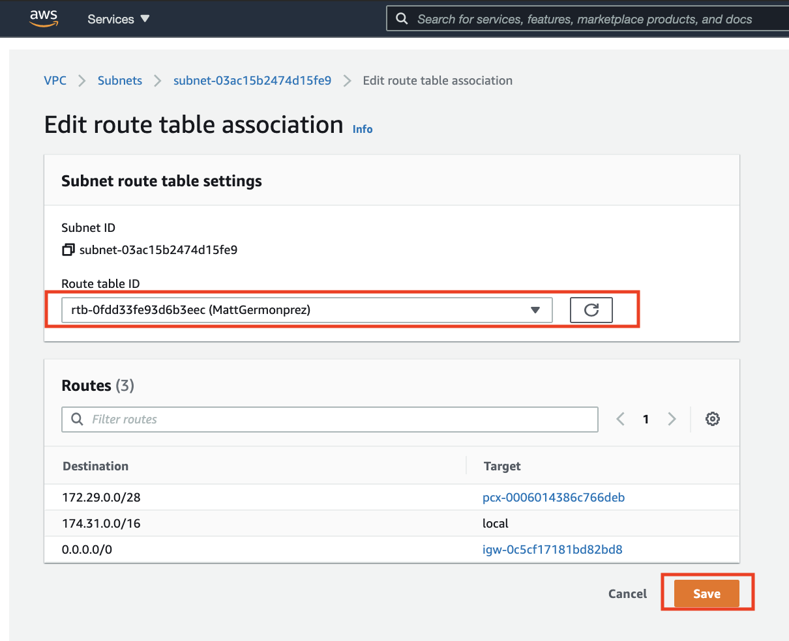

ifndef::bound[]
:imagesdir: img
endif::[]

This lab is intended to give you just a bit more insight with respect to AWS cloud computing. In this lab, I will be setting up two machines and having them talk to (ping) each other. This lab is a bit different from the rest in that you will be following along with the videos and then answering a series of questions associated with the work. That is, you DO NOT need to set up the peering connection on your end. I sort of talk like you need to do the technical work in the video, but you do not. All that I want you to do is watch the video and then answer the questions at the end of this document. 

(sorry, the video was made recently with the expectation that all resources are AWS Educate ready and I'm concerned that they are not really available to us. So all you have to do is watch the video, you do not need to do the peering work on your end in AWS). 

To start, I'll login to my AWS1 account (I'll call this account the BLUE account). There you will see VPCs along with other services in the VPC dashboard. 

.VPC
image::1.png[VPC]

{nbsp} +
{nbsp} +
 
I'll click on the VPCs link and from there click Create VPC. 

.Create VPC
image::2a.png[Create VPC]

.Create VPC
image::2b.png[Create VPCb]

{nbsp} +
{nbsp} +
 
From there, I'll name the VPC. Again this is all in my BLUE account. In the CIDR block, put some block of local addresses. In this case I put a relatively small block of addresses. 

.VPC Settings
image::3a.png[VPC Settings]

.VPC Settings
image::3b.png[VPC Settingsb]

{nbsp} +
{nbsp} +

Once I have created the VPC, I will need to create a subnet within that VPC. Clicking on the Subnets over on the left side, then clicking Create Subnet. Again, still in the BLUE account and very similar (same?) to the work you did last week. 

.Create Subnet
image::4.png[Create Subnet]

{nbsp} +
{nbsp} +

In the create subnet screen I fill out the appropriate details. In this case, I have to assign the subnet to the VPC that I just created. Also, In this example, the subnet is the size of the VPC (the blocks are the same size). 

.Subnet Details
image::5.png[Subnet Details]

{nbsp} +
{nbsp} +

Now I'll create a route. Again, this is all in the BLUE account. The route will define where traffic can and can't flow in the VPC/subnet. I click Route Tables on the left side and then click Create route table. 

.Create Route Table
image::6.png[Create Route Table]

{nbsp} +
{nbsp} +

Like the subnet, I assign the route table to a VPC. Pretty easy. 

.Route Table Details
image::7.png[Route Table Details]

{nbsp} +
{nbsp} +

At this point, my VPC is starting to get a bit of robustness associated with it. It has a name. It has a subnet. It has a route table. Growing up! Now I need to estabish an Internet Gatewary for my VPC -- so it can go on the internet. I click on Internet Gateways on the left and then click Create Internet Gateway. 

.Internet Gateway
image::8.png[Internet Gateway]

{nbsp} +
{nbsp} +

I name the Internet Gateway and click Create! 

.Internet Gateway Details
image::9.png[Internet Gateway Details]

{nbsp} +
{nbsp} +

SUPER IMPORTANT!!! Once I create the gateway, the next screen will ask if I would like to associate the gateway with a VPC (green bar at the top). I must do this -- associating it with my newly created VPC. Again, all of this is in my BLUE account. 

.Associate Internet Gateway with VPC
image::9a.png[Associate Internet Gateway with VPC]

{nbsp} +
{nbsp} +

.Associate Internet Gateway with VPC
image::9b.png[Associate Internet Gateway with VPC]

{nbsp} +
{nbsp} +

Now I return to my Route Table and add the newly created Internet Gateway. 

.Add Internet Gateway to Route Table
image::10.png[Add Internet Gateway]

{nbsp} +
{nbsp} +

.Add Internet Gateway to Route Table
image::11.png[Add Internet Gateway]

{nbsp} +
{nbsp} +

I'm now ready to create the Peering Connection! I click Peering Connections on the left and then Create Peering Connection on the top. The large numbers you see there are the things I am going to need to set up the peering conneciton

.Create Peering Connection
image::12.png[Create Peering Connection]

{nbsp} +
{nbsp} +

Here are the details of the Create Peering Connection page. These should be pretty straightforward. Basically, I am connecting the BLUE VPC to another VPC (let's call that one RED). The details in the bottom must be exactly as they are in this picture

.Peering Details
image::13.png[Peering Details]

{nbsp} +
{nbsp} +

A little clean-up here at the end. 1) I add the newly created Peering Connection to my list of routes and 2) ensure that your route table is aligned with my subnet. 

.Add Peering Connection to Routes
image::14.png[Add Peering Connection to Routes]

{nbsp} +
{nbsp} +

.Add Peering Connection to Routes
image::15.png[Add Peering Connection to Routes]

{nbsp} +
{nbsp} +

.Associate Route Table with Subnet
image::16.png[Associate Route Table with Subnet]

{nbsp} +
{nbsp} +

.Associate Route Table with Subnet

{nbsp} +
{nbsp} +

At this I am really done. From the second (RED) VPC, I will see the peering request (from BLUE)

{nbsp} +
{nbsp} +

If (when) I accept the peering request, I will now see it as Active. If I don't accept the request in time, I'll see a red status marker and it'll say something like timeout. 

.Seeing Peering Connection
image::19.png[Seeing Peering Connection]

{nbsp} +
{nbsp} +

That's it. The video should help too. Again, I made the video assuming that you would do the work in AWS but you won't be doing that. After our few AWS resource issues, I'm a bit hesitant. So, answer these questions for the lab. That's it!

1) What is peering? 
2) What is a route table? 
3) What is an internet gateway? 
4) Draw me a picture of what has been designed here (the final design and not the process). This should include a VPCs, subnets, and any number-details that help me understand the design that was just created. 

